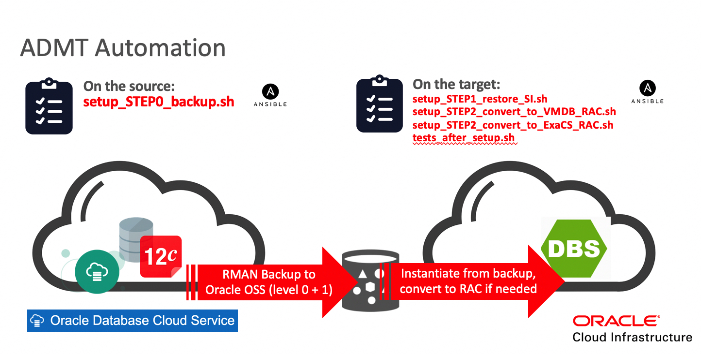
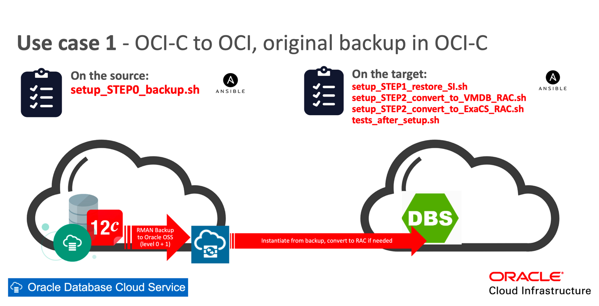
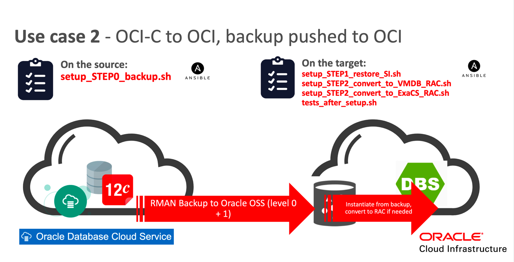
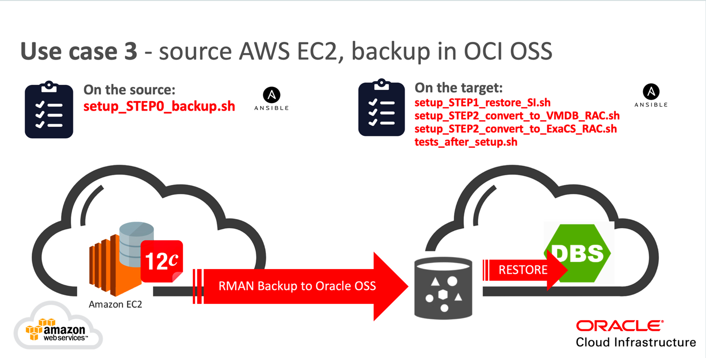

# Ansible Database Migration Tool (ADMT)

## Tool description

Ansible Database Migration Tool (ADMT) utility has been developed with an objective to provide a quick and easy way to move Oracle Cloud Infrastructure Classic (OCI-C) databases to Oracle Cloud Infrastructure (OCI) without setting up DataGuard. Tool has been tested also with AWS, where database has been manually installed on top of EC2 compute instances (no AWS RDS). It could be used when source and target sides are disconnected in terms of direct peering between OCI-C's availability domains and OCI's tenancy. As a medium for data transport utility will use Object Storage Service (OSS) which is cloud-based service available both in OCI-C and OCI. On the source database would be backed up into OSS with the RMAN. Then on the target side RMAN will help to instantiate database from the backup by proper restore/recovery procedure. For minimal downtime incremental level 0 + number of level 1 backups will be used. Tool has been written in Ansible, with the usage of dedicated modules in Python (/modules).  


 
## Supported Database Release

ADMT supports such database releases as:
* Oracle Database 11g Release 2 (11.2)
* Oracle Database 12c Release 1 (12.1)
* Oracle Database 12c Release 2 (12.2)
* Oracle Database 18c (18.3)
 
## Supported Database Architecture

ADMT supports such architectures as:
* Oracle Database Single-Instance
* Oracle Database Real Application Clusters (RAC)
 
## Supported Migration Paths

ADMT will help to execute migration for such use-cases:
* From AWS SI database installed on top of EC2 compute
* From OCI-C SI/RAC DBCS to OCI SI/RAC DBaaS/DBSystem
* From OCI-C RAC DBCS to OCI ExaCS 
* From OCI-C ExaCS to OCI ExaCS (currently limited to 2-nodes configuration)

## Supported OSS for RMAN transport

ADMT could work with this Object Store Services (OSS) as follows:
* Oracle Cloud Infrastructure Object Storage Classic
* Oracle Cloud Infrastructure Object Storage

## ADMT Use cases







## How to use ADMT

### Step 0. 
In OCI create skeleton database service. This skeleton database will be overwritten by the restore 
encoded in this automation. For automatic backups you should enable it in OCI Cloud Console. 

### Step 1. 
Download RMAN cloud module zip file from https://www.oracle.com/technetwork/database/availability/oracle-cloud-backup-2162729.html and put this file into directory 
which will be then defined as opc_installer_zip_src_location variable in *setup.json* file. 

### Step 2. 
Define *inventory* file (use templates from */examples* subdirectory as a starting point)

### Step 3a.
In case of non-Exadata environments you can use *discovery_setup_json.sh* to collect some values for setup.json payload file. After succesful execution you should expect *setup.json_discovery_<timestamp>* file in root directory of ADMT. Of course you can collect all data manually as well and of course some data still need to be provided by hand and cannot be derived (for example backup configuration for transport and then on the target side)

```
[opc@ansible-server ~]$ ./discovery_setup_json.sh

Argument source_dbname is
Argument target_dbname is 
Executing ansible-playbook with discovery_setup_json.yml file where oracle_source_dbname.

1) oracle_source_dbname will be empty. Expecting only one ORACLE_HOME in oraInventory on the source (non Exadata environment).
2) oracle_target_dbname will be empty. Expecting only one ORACLE_HOME in oraInventory on the target (non Exadata environment).

PLAY [Display oracle_source_dbname and oracle_target_dbname] *******************************************************************************************************

TASK [Gathering Facts] *********************************************************************************************************************************************
ok: [localhost]

TASK [Display oracle_source_dbname] ********************************************************************************************************************************
ok: [localhost] => {
    "msg": "oracle_source_dbname = ''"
}

TASK [Display oracle_target_dbname] ********************************************************************************************************************************
ok: [localhost] => {
    "msg": "oracle_target_dbname = ''"
}

(...)

TASK [Save setup.json_discovery_XXXXXXXXXXXXXXX file] **************************************************************************************************************
changed: [localhost]

TASK [Content of setup.json_discovery_XXXXXXXXXXXXXXX file] ********************************************************************************************************
ok: [localhost] => {
    "msg": "(...)"
}

PLAY RECAP *********************************************************************************************************************************************************
10.10.10.10            : ok=23   changed=0    unreachable=0    failed=0
10.10.10.11               : ok=14   changed=0    unreachable=0    failed=0
localhost                  : ok=3    changed=1    unreachable=0    failed=0

[opc@ansible-server ~]$ ls -latr 
(...)
-rwxr-xr-x   1 lukaszfeldman  staff     240 29 kwi 12:45 discovery_source.sh
-rwxr-xr-x   1 lukaszfeldman  staff     295 29 kwi 13:16 discovery_setup_json.sh
-rw-r--r--   1 lukaszfeldman  staff    1734 29 kwi 13:16 setup.json_discovery_20190429T131644
drwxr-xr-x  39 lukaszfeldman  staff    1248 29 kwi 13:16 .

[opc@ansible-server ~]$ less setup.json_discovery_20190429T131644
# setup.json - please fill empty values of variables which have not been discovered/configured so far.
{
"opc_installer_zip_src_location": "",
"oci_endpoint_url": "",
"oci_tenancy": "",
"oci_user": "",
"oci_authtoken_pass": "",
"oci_oss_container": "",

"oracle_source_RAC": "False",
"oracle_source_database_sid": "src12r1",
"oracle_source_ohome_dir": "/u01/app/oracle/product/12.1.0/dbhome_1",
"oracle_source_dbid": "176070364",
"oracle_source_wallet_dir": "/u01/app/oracle/admin/src12r1/tde_wallet",
"oracle_source_database_unique_name": "src12r1",
"oracle_source_version": "12.1.0.2",
"oracle_source_sysdba_password": "",

"oracle_target_ohome_dir": "/u01/app/oracle/product/12.1.0.2/dbhome_1",
"oracle_target_adump_dir": "/u01/app/oracle/admin/src12r1_phx1f8/adump",
"oracle_target_racnode1_adump_dir": "",
"oracle_target_racnode2_adump_dir": "",
"grid_target_ohome_dir": "/u01/app/12.2.0.1/grid",
"oracle_target_database_unique_name": "src12r1_phx1f8",
"oracle_target_wallet_dir": "/opt/oracle/dcs/commonstore/wallets/tde",
"grid_oracle_database_sid": "+ASM1",
"grid_target_data_dg": "+DATA",
"grid_target_reco_dg": "+RECO",

"oracle_target_database_oci_endpoint_url": "",
"oracle_target_database_oci_tenancy": "",
"oracle_target_database_oci_user": "",
"oracle_target_database_oci_authtoken_pass": "",
"oracle_target_database_oci_bucketname": "",

"prepare_rman_on_source": "True",
"tde_upload_to_oss": "True",
"backup_level0": "True",
"backup_level1": "True",
"clear_source_on_target": "True",
"prepare_rman_on_target": "True",

"tde_download_from_oss": "True",
"restore_level0": "True",
"restore_level1": "True",
"open_resetlogs": "True",
"register_in_OCI": "False",

"convert_to_RAC": "False",
"convert_to_ExaCS": "False"
}
```

### Step 3b.
In case of Exadata environments you have multihome configuration and you need to provide database_unique_name to *discovery_setup_json.sh*. In the example below we are moving AWS SI 11gR2 to ExaCS in OCI. In OCI Console we can obtain database_unique_name (aws112db_phx18q). We should provide this value for the -t parameter (target). If ExaCS is on the source we should use -s (source) parameter:

```
[opc@ansible-server ~]$ ./discovery_setup_json.sh -t 'aws112db_phx18q'
Argument source_dbname is
Argument target_dbname is aws112db_phx18q
Executing ansible-playbook with discovery_setup_json.yml file where oracle_source_dbname.

1) oracle_source_dbname will be empty. Expecting only one ORACLE_HOME in oraInventory on the source (non Exadata environment).
2) oracle_target_dbname has been set to aws112db_phx18q. Script will try to extract ORACLE_HOME for this database (multihome, Exadata environment).

PLAY [Display oracle_source_dbname and oracle_target_dbname] *******************************************************************************************************

TASK [Gathering Facts] *********************************************************************************************************************************************
ok: [localhost]

TASK [Display oracle_source_dbname] ********************************************************************************************************************************
ok: [localhost] => {
    "msg": "oracle_source_dbname = ''"
}

TASK [Display oracle_target_dbname] ********************************************************************************************************************************
ok: [localhost] => {
    "msg": "oracle_target_dbname = 'aws112db_phx18q'"
}

(...)

TASK [Content of setup.json_discovery_XXXXXXXXXXXXXXX file] ********************************************************************************************************
ok: [localhost] => {
    "msg": "(...)"
}

PLAY RECAP *********************************************************************************************************************************************************
10.10.10.10             : ok=23   changed=0    unreachable=0    failed=0
10.10.10.11             : ok=14   changed=0    unreachable=0    failed=0
localhost                  : ok=6    changed=1    unreachable=0    failed=0

[opc@ansible-server ~]$ ls -latr 
(...)
-rw-r--r--   1 lukaszfeldman  staff    2073 30 kwi 07:49 setup.json
-rwxr-xr-x   1 lukaszfeldman  staff    1250 30 kwi 07:49 discovery_setup_json.sh
-rw-r--r--   1 lukaszfeldman  staff    1874 30 kwi 07:50 setup.json_discovery_20190430T075012
drwxr-xr-x  41 lukaszfeldman  staff    1312 30 kwi 07:50 .

[opc@ansible-server ~]$ less setup.json_discovery_20190430T075012
# setup.json - please fill empty values of variables which have not been discovered/configured so far.
{
"opc_installer_zip_src_location": "",
"oci_endpoint_url": "",
"oci_tenancy": "",
"oci_user": "",
"oci_authtoken_pass": "",
"oci_oss_container": "",

"oracle_source_RAC": "False",
"oracle_source_database_sid": "aws112db",
"oracle_source_ohome_dir": "/u01/app/oracle/product/11.2.0.4/db_1",
"oracle_source_dbid": "3503609890",
"oracle_source_wallet_dir": "/u01/app/oracle/product/11.2.0.4/db_1/admin/aws112db/wallet",
"oracle_source_database_unique_name": "aws112db",
"oracle_source_version": "11.2.0.4",
"oracle_source_sysdba_password": "",

"oracle_target_ohome_dir": "/u02/app/oracle/product/11.2.0/dbhome_2",
"oracle_target_adump_dir": "/u02/app/oracle/product/11.2.0/dbhome_2/rdbms/audit",
"oracle_target_racnode1_adump_dir": "/u02/app/oracle/product/11.2.0/dbhome_2/rdbms/audit",
"oracle_target_racnode2_adump_dir": "/u02/app/oracle/product/11.2.0/dbhome_2/rdbms/audit",
"grid_target_ohome_dir": "/u01/app/18.1.0.0/grid",
"oracle_target_database_unique_name": "aws112db_phx18q",
"oracle_target_wallet_dir": "/var/opt/oracle/dbaas_acfs/aws112db/tde_wallet",
"grid_oracle_database_sid": "+ASM1",
"grid_target_data_dg": "+DATAC1",
"grid_target_reco_dg": "+RECOC1",

"oracle_target_database_oci_endpoint_url": "",
"oracle_target_database_oci_tenancy": "",
"oracle_target_database_oci_user": "",
"oracle_target_database_oci_authtoken_pass": "",
"oracle_target_database_oci_bucketname": "",

"prepare_rman_on_source": "True",
"tde_upload_to_oss": "False",
"backup_level0": "True",
"backup_level1": "True",

"clear_source_on_target": "True",
"prepare_rman_on_target": "True",
"tde_download_from_oss": "False",
"restore_level0": "True",
"restore_level1": "True",
"open_resetlogs": "True",
"register_in_OCI": "False",

"convert_to_RAC": "True",
"convert_to_ExaCS": "True"
}

```

### Step 4.
Define *setup.json* file (use templates from */examples* subdirectory as a starting point). Optionally use output from the script executed in the step 3. Please fill empty values of variables which have not been discovered/configured so far (oci_****** and oracle_target_database_oci_******).

### Step 5.
Execute the sequence of shell scripts (wrappers for ansible-playbook utility). First execution will cover the source side (OCI-C). This step is not obligatory with all substeps when restore in OCI is based on OCI-C OSS. For more details please check ADMT advanced configuration section below.

```
[opc@ansible-server ~]$  ./setup_STEP0_backup.sh 

PLAY [Backup source OCI-C DBCS] **********************************************************************************************************************************

TASK [Gathering Facts] *******************************************************************************************************************************************
ok: [10.10.10.10]

TASK [source_backup_role : Upload Oracle Database Cloud Backup Module] *******************************************************************************************
skipping: [10.10.10.10]

(...)

TASK [source_backup_role : Starting RMAN backup incremental level 1 for database plus archivelog to OSS on the source (source SI)] *******************************
skipping: [10.10.10.10]

PLAY RECAP *******************************************************************************************************************************************************
10.10.10.10             : ok=16   changed=3    unreachable=0    failed=0
```

### Step 6.
Next execution covers the target side (OCI). First script is for Single Instance (SI) restore:

```
[opc@ansible-server ~]$  ./setup_STEP1_restore_SI.sh

PLAY [Restore source on target OCI DBSystem] *********************************************************************************************************************

TASK [Gathering Facts] *******************************************************************************************************************************************
ok: [10.10.10.10]

TASK [target_restore_role : Shutdown source on target] ***********************************************************************************************************
ok: [10.10.10.10] 

(...)

PLAY RECAP *******************************************************************************************************************************************************
10.10.10.10             : ok=114  changed=28   unreachable=0    failed=0
```

### Step 7.
In case of migration from AWS (or on-premise) it is very possible TDE has not been enabled and you need to
execute additional automation (in OCI-C to OCI migration you can skip this step):

```
[opc@ansible-server ~]$  ./setup_STEP1a_enable_tde.sh

PLAY [Enable TDE on target OCI DBSystem] ***************************************************************************************************************************

TASK [Gathering Facts] *********************************************************************************************************************************************
ok: [10.10.10.10]
(...)
TASK [target_enable_tde_role : Creating keystore (12.1+)] **********************************************************************************************************
ok: [10.10.10.10]

TASK [target_enable_tde_role : Opening CDB$ROOT keystore (12.1+)] **************************************************************************************************
ok: [10.10.10.10]

TASK [target_enable_tde_role : Opening keystore on every PDB (12.1+)] **********************************************************************************************
ok: [10.10.10.10] => (item=PDB1)

TASK [target_enable_tde_role : Setting Master Key (12.1+)] *********************************************************************************************************
ok: [10.10.10.10]

(...)

TASK [target_enable_tde_role : Showing wallet status (18c+)] *******************************************************************************************************
ok: [10.10.10.10] => {
    "msg": [
        [
            "         1",
            "/opt/oracle/dcs/commonstore/wallets/tde/awsoradb_phx12g/",
            "OPEN                           LOCAL_AUTOLOGIN",
            "         2",
            "OPEN                           LOCAL_AUTOLOGIN",
            "         3",
            "OPEN                           LOCAL_AUTOLOGIN"
        ],
        "",
        "",
        "/u01/app/oracle/product/18.0.0.0/dbhome_1/bin/sqlplus -S /  as sysdba"
    ]
}
(...)
PLAY RECAP *********************************************************************************************************************************************************
10.10.10.10            : ok=14   changed=1    unreachable=0    failed=0
```

### Step 8. 
Then next script will convert SI into RAC. Two alternatives are possible (VMDB RAC or ExaCS RAC):

```
[opc@ansible-server ~]$  ./setup_STEP2_convert_to_VMDB_RAC.sh 

PLAY [Convert source SI to target RAC on OCI DBSystem (racnode1)] ************************************************************************************************

TASK [Gathering Facts] *******************************************************************************************************************************************
ok: [10.10.10.10]

TASK [target_convert_to_racnode1_role : Make directory for audit trail on target racnode1] ***********************************************************************
ok: [10.10.10.10]

(...)

TASK [target_convert_to_racnode2_role : Upload tnsnames.ora file template for instance2 on racnode2 (no multitenant without PDBs, 11g)] **************************
skipping: [10.10.10.11]

PLAY RECAP *******************************************************************************************************************************************************
10.10.10.10             : ok=32   changed=14   unreachable=0    failed=0
10.10.10.11             : ok=20   changed=3    unreachable=0    failed=0
```

**or:**

```
[opc@ansible-server ~]$  ./setup_STEP2_convert_to_ExaCS_RAC.sh 

PLAY [Convert source SI to target RAC on OCI DBSystem (racnode1)] ******************************************************************************************************

TASK [Gathering Facts] *************************************************************************************************************************************************
ok: [10.10.10.10]

TASK [target_convert_to_exacs_racnode1_role : Make directory for audit trail on target racnode1] ***********************************************************************
ok: [10.10.10.10]

(...)

TASK [target_convert_to_exacs_racnode2+_role : Showing status of source database on the target again (taken from to CRS registry with SRVCTL)] *************************
skipping: [10.10.10.11]

PLAY RECAP *************************************************************************************************************************************************************
10.10.10.10            : ok=39   changed=14   unreachable=0    failed=0
10.10.10.11             : ok=29   changed=5    unreachable=0    failed=0
```


### Step 9.

**Step limited to VMDB, no ExaCS support.**

Execute this script for setting backup in OCI Control Plane (via DBCLI). We have to options: (1) automatic backup available in OCI Console and (2) manual backup executed with DBCLI, based on predefined bucket.

If you want to use automatic backups you should then stay with empty values for oracle_target_database_oci_**** variables in *setup.json* file:

```
[opc@ansible-server ~]$  cat setup.json | grep oracle_target_database_oci_

"oracle_target_database_oci_endpoint_url": "",
"oracle_target_database_oci_tenancy": "",
"oracle_target_database_oci_user": "",
"oracle_target_database_oci_authtoken_pass": "",
"oracle_target_database_oci_bucketname": "",
```

If you want to create your own manual backups (scheduled in crotab) with DBCLI then first you need to create a bucket and set it in *setup.json* file (here it will be *bkup_src18si_phx1vx*). 

```
[opc@ansible-server ~]$  cat setup.json | grep oracle_target_database_oci_

"oracle_target_database_oci_endpoint_url": "https://swiftobjectstorage.us-phoenix-1.oraclecloud.com/v1",
"oracle_target_database_oci_tenancy": "mytenancy",
"oracle_target_database_oci_user": "myuser",
"oracle_target_database_oci_authtoken_pass": "****************",
"oracle_target_database_oci_bucketname": "mybucket",
```

Next we need to execute setup_STEP3_backup_config:

```
[opc@ansible-server ~]$  ./setup_STEP3_backup_config.sh
```

After this automation we should see such output from dbcli list-jobs:

```
[root@src121si ~]# /opt/oracle/dcs/bin/dbcli list-jobs

ID                                       Description                                                                 Created                             Status
---------------------------------------- --------------------------------------------------------------------------- ----------------------------------- ----------
7ed010a6-6ff0-4ca9-affb-359849600f0a     delete backup config:bkupcfg_src121si_iad1qp                                April 2, 2019 1:48:25 PM UTC        Success
1f547421-f49c-40b2-b25b-ecc6b55bda11     delete object store swift:bkup_src121si_iad1q                               April 2, 2019 1:50:37 PM UTC        Success
655dee03-b853-4604-bdc2-e20a7ffcc7b5     create object store:bkup_src121si_iad1q                                     April 2, 2019 1:50:45 PM UTC        Success
e743e610-48f2-4689-9261-6d421499339f     create backup config:bkupcfg_src121si_iad1qp                                April 2, 2019 1:52:01 PM UTC        Success
4f8c85b4-2d72-49b1-bda2-984d93797e19     update database : src121si                                                  April 2, 2019 1:54:24 PM UTC        Success
760e7415-6bfa-4398-a962-70fff69788b5     Create Longterm Backup with TAG-Longterm_src121si_iad1qp for Db:src121si in OSS:bkup_src121si_iad1q April 2, 2019 1:57:48 PM UTC        Success
```

In case of automatic backups option we should disable and enable automatic backup (in OCI Cloud Console). After this 
we should see such entries in dbcli list-jobs command:

```
[root@src121si ~]# /opt/oracle/dcs/bin/dbcli list-jobs

ID                                       Description                                                                 Created                             Status
---------------------------------------- --------------------------------------------------------------------------- ----------------------------------- ----------
(...)
deedadcf-f4a8-4da8-b6a3-699b537939bc     Create Regular-L0 Backup with TAG-DBTRegular-L015560341024409nm for Db:src12rac in OSS:bqppYUQsWZVBGShce41K April 23, 2019 3:58:40 PM UTC       Failure
9cf6b6c1-27fd-4b79-9b2e-5b25aecf70ca     Create Regular-L0 Backup with TAG-DBTRegular-L01556035319092onc for Db:src12rac in OSS:bqppYUQsWZVBGShce41K April 23, 2019 4:03:07 PM UTC       Success
93429896-acc6-45d7-b316-abc22cdb4b5b     Delete Backup for Database name: src12rac_iad1fn                            April 23, 2019 4:07:46 PM UTC       Success
a8a76163-95f7-4411-b49c-30c4b4ba1047     update database : src12rac                                                  April 23, 2019 4:13:52 PM UTC       Success
5126ebf0-7eb1-48ab-b91a-a7db632e44fe     Create Regular-L1 Backup with TAG-DBTRegular-L11556036183298c2S for Db:src12rac in OSS:bqppYUQsWZVBGShce41K April 23, 2019 4:17:31 PM UTC       Success
3927924a-55ec-4359-8164-5a28313ff9a5     Delete Backup for Database name: src12rac_iad1fn                            April 23, 2019 4:20:20 PM UTC       Success
```

### Step 10.
Execute this script for testing and validation of the migrated database in OCI:

```
[opc@ansible-server ~]$  ./test_after_setup.sh

PLAY [Test and validate source on target OCI DBSystem] ***********************************************************************************************************

TASK [Gathering Facts] *******************************************************************************************************************************************
ok: [10.10.10.10]
ok: [10.10.10.11]

(...)

TASK [target_tests_and_validation_role : Download report from remote host to local host reports subdirectory] ****************************************************
changed: [10.10.10.10]
changed: [10.10.10.11]

PLAY RECAP *******************************************************************************************************************************************************
10.10.10.10             : ok=40   changed=22   unreachable=0    failed=0
10.10.10.11             : ok=40   changed=22   unreachable=0    failed=0
```

### Step 11.

Review text file report generated by previous step. Go to */report* subdirectory (for RAC two ore more files - log file per racnode):

```
[opc@ansible-server ~]$  less reports/report_after_setup_source_db_src12r1_on_target_host_s121rac1_20190321T162514.log

##########################################################################
# This report shows the tests after migration from OCI-C RAC to OCI RAC! #
##########################################################################

Database Instance Name: src12r11
Database Unique Name:   src12r1
Database Oracle Home:   /u01/app/oracle/product/12.1.0.2/dbhome_1
Database Version:       12.1.0.2
OCI ExaCS Platform:     False
OCI RAC hostname:       s121rac1

TEST_1: Checking status of databases on all nodes
########################################################

Executed command:
/u01/app/oracle/product/12.1.0.2/dbhome_1/bin/srvctl status database -db src12r1

Command output:
Instance src12r11 is running on node s121rac1
Instance src12r12 is running on node s121rac2
(...)
```

## Advanced configuration of ADMT

### Monitoring RMAN execution in the log files

In case of long backup or restore operations, you can go directly into the machine (the source or the target) and within */tmp* directory you can check the log files as follow:

```
[opc@ansible-server ~]$ ssh -i /home/opc/.ssh/id_rsa opc@129.215.161.92
Last login: Thu Mar 21 20:41:58 2019 from 129.213.51.26

[opc@src12rac1 ~]$ ls -latr /tmp/rman_*
(...)
-rw-r--r-- 1 oracle oinstall 1005 03-21 20:38 /tmp/rman_restore_controlfile_src12rac_20190321T202310.log

[opc@src12rac1 ~]$ tail -f /tmp/rman_restore_controlfile_src12rac_20190321T202310.log
channel c1: AUTOBACKUP found: c-4074938617-20190320-01
channel c1: restoring control file from AUTOBACKUP c-4074938617-20190320-01
channel c1: control file restore from AUTOBACKUP complete
output file name=+RECO/SRC12RAC/CONTROLFILE/current.269.1003523519
Finished restore at 21-MAR-19
released channel: c1

RMAN>

Recovery Manager complete.
```

In case of need this */tmp* directory can be changed in *default/main.yml* file:

```
[opc@ansible-server ~]$ more defaults/main.yml | grep rman_log_path
rman_log_path: "/tmp"
```

Additionally on the target host you can execute the statment as follows:

```
SQL> 
alter session set nls_date_format='dd/mm/yy hh24:mi:ss'
/
select SID, START_TIME,TOTALWORK, sofar, (sofar/totalwork) * 100 done,
sysdate + TIME_REMAINING/3600/24 end_at
from v$session_longops
where totalwork > sofar
AND opname NOT LIKE '%aggregate%'
AND opname like 'RMAN%'

SQL>
Session altered.

SQL>   2    3    4    5    6    7

       SID START_TIME	      TOTALWORK      SOFAR	 DONE     END_AT
---------- ----------------- ---------- ---------- ---------- -----------------
	    16 01/04/19 12:18:36   11643136    5008921  43.020377 01/04/19 13:33:49
       134 01/04/19 12:18:45   11643648    4859613 41.7361724 01/04/19 13:35:55
       135 01/04/19 12:18:21   11645184    6237496 53.5628806 01/04/19 13:19:19
       370 01/04/19 12:18:37   11643776    5114359 43.9235434 01/04/19 13:32:16
```


### Using existing source database's backup in OCI-C

If you want to utilize already existing backup in OCI-C for particular DBCS system, you need to define this OCI-C OSS configuration in *setup.json* file. On the other hand, if you want to omit the configuration of RMAN module in OCI-C you need to disable configuration in the setup.json file. As a consequence script will utilize current RMAN configuration for SBT_TAPE library on the source. Here is the example:

```
[opc@ansible-server ~]$  more setup.json
"opc_installer_zip_src_location" : "/home/opc/opc_installer.zip",
"oci_endpoint_url": "https://ocic_account.us.storage.oraclecloud.com/v1/Storage-ocic_account",
"oci_tenancy": "",
"oci_user": "myuser",
"oci_authtoken_pass": "****************", 
"oci_oss_container": "dbcs-mydatabase",
(...)
"prepare_rman_on_source": "False",
"tde_upload_to_oss": "True",
"backup_level0": "True",
"backup_level1": "True",
(...)
```

**WARNING!** In case of using OCI-C backups you need to be sure about
the status of your RMAN's BACKUP OPTIMIZATION - it should be set to OFF:

```
RMAN> CONFIGURE BACKUP OPTIMIZATION OFF;

old RMAN configuration parameters:
CONFIGURE BACKUP OPTIMIZATION ON;
new RMAN configuration parameters:
CONFIGURE BACKUP OPTIMIZATION OFF;
new RMAN configuration parameters are successfully stored
```

### Enlarging number of RMAN channels for restore and recovery

Default value for the number of RMAN channels is 6. If you want to enlarge it you will need to change the value of rman_channels_number:

```
[opc@ansible-server ~]$ more defaults/main.yml | grep rman_channels_number
rman_channels_number: "6"
```

### Disabling RMAN encryption on transit

By default RMAN encryption on transit is enabled and password is set to some value. You can disable it by commenting this variable in the *default/main.yml* file.

```
[opc@ansible-server ~]$ more defaults/main.yml | grep rman_password_on_transit
rman_password_on_transit: "aq12ws"
```

### Enlarging timeout for RMAN asynchronous tasks

By default RMAN operations will be executed as Ansible asynchronous tasks (https://docs.ansible.com/ansible/latest/user_guide/playbooks_async.html). It means Ansible will fork a process on the source or on the target system and periodically (every 30 seconds) it will check forked process status. This periodical checking will persist until predefined timeout. You can enlarge it for bigger databases. Default value is 144000 seconds = 40 hours. 

```
[opc@ansible-server ~]$ more defaults/main.yml | grep ansible_async_
ansible_async_backup_source_timeout: "144000"
ansible_async_restore_source_timeout: "144000"
```

## Known problems:

### Problem1 - PDB$SEED not included in the backup on source (OCI-C)

**Problem description**:

Restore from level 0 backup in OCI fails with the RMAN's errors as follows:
```
RMAN-06026: some targets not found - aborting restore
RMAN-06023: no backup or copy of datafile 8 found to restore
RMAN-06023: no backup or copy of datafile 6 found to restore
RMAN-06023: no backup or copy of datafile 5 found to restore
```

**Action to be taken**:

Check if PDB$SEED is included in the backups, turn RMAN's BACKUP OPTIMZATION to OFF
and backup PDB$SEED files manually into OCI-C object container:
```
RMAN> run {
allocate channel c1 device type sbt PARMS "SBT_LIBRARY=libopc.so, ENV=(OPC_PFILE=/u01/app/oracle/product/12.2.0/dbhome_1/dbs/opcORCL.ora)";
backup datafile 5,6,8;
}
```

### Problem2 - Discovery fails on "sudo: sorry, you must have a tty to run sudo"

**Problem description**:

Discovery fails on the begining with the error as follows:
```
TASK [source_discovery_role : Discover source database and GI] ****************************************************************************************************************
(...)
<130.162.64.141> (1, b'', b'sudo: sorry, you must have a tty to run sudo\n')
fatal: [130.162.64.141]: FAILED! => {
    "changed": false,
    "module_stderr": "sudo: sorry, you must have a tty to run sudo\n",
    "module_stdout": "",
    "msg": "MODULE FAILURE\nSee stdout/stderr for the exact error",
    "rc": 1
}
```

**Action to be taken**:

Go to the source machine and change (temporary) /etc/sudoers as follows:
```
[root@lukeocic ~]# more /etc/sudoers | grep tty
# Refuse to run if unable to disable echo on the tty.
Defaults   !requiretty
```

### Problem3 - Backup fails with error "ORA-19836: cannot use passphrase encryption for this backup"

**Problem description**:

Backup fails with the error "ORA-19836: cannot use passphrase encryption for this backup":
```
"RMAN-00569: =============== ERROR MESSAGE STACK FOLLOWS ===============", 
"RMAN-00571: ===========================================================", 
"RMAN-03002: failure of backup plus archivelog command at 12/19/2019 06:33:58", 
"", 
"RMAN-03009: failure of backup command on c1 channel at 12/19/2019 06:30:56", 
"ORA-19836: cannot use passphrase encryption for this backup", 
```

**Action to be taken**:

Go to the *default/main.yml* file in the ADMT root directory and hash *rman_password_on_transit* variable as follows:
```
[opc@ansible-server ~]$ more defaults/main.yml | grep rman_password_on_transit
#rman_password_on_transit: "<rman_password>"
```

### Problem4 - Backup fails with error "RMAN-06909"

**Problem description**:

Backup fails with the warnings/errors: 

```
"RMAN-06908: WARNING: operation will not run in parallel on the allocated channels," 
"RMAN-06909: WARNING: parallelism require Enterprise Edition".
```

**Action to be taken**:

Go to the *default/main.yml* file in the ADMT root directory and reduce variable *rman_channels_number* to value *1* as follows:
```
[opc@ansible-server ~]$ more defaults/main.yml | grep rman_channels_number
rman_channels_number: "1"
```

## Contributors

Luke Feldman ([lukasz.feldman@oracle.com](mailto:lukasz.feldman@oracle.com))

## How to Contribute

Please review [CONTRIBUTING.md](CONTRIBUTING.md) file. 

## License

Copyright (c) 2020, Oracle and/or its affiliates. 
The Universal Permissive License (UPL), Version 1.0
